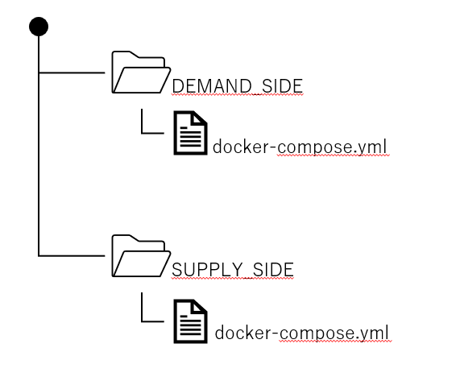
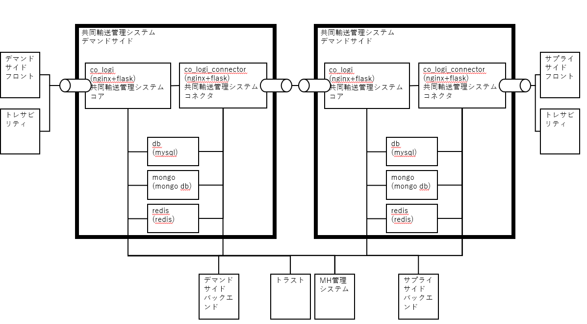

# 共同輸送管理システム

## 構成

- 共同輸送管理システムは、デマンドサイド、サプライサイドでソースは共有できるようにしていますが、それぞれ別々に構築する必要があります。
- 各サイドでは共同輸送管理システム・コアと共同輸送管理システム・コネクタにサーバーが分かれています。
  - 共同輸送管理システム・コアはコントロールプレーンにあたり、主にフロントエンドや他機能部とのAPIを提供しています。
  - 共同輸送管理システム・コネクタはデータプレーンにあたり、デマンドサイド⇔サプライサイド、サプライサイド⇔サプライサイドのデータ転送を行うためのAPIとコントロールプレーンとのAPIを提供します。
    - 今回の共同輸送管理システムではダイヤ等のデータはDBにキャッシュしていないため、DBではなくバックエンドシステムに問い合わせを行いデータの取得、更新を行います。
- 共同輸送管理システムは、Dockerで環境構築しています。デマンドサイド、サプライサイドそれぞれ用のディレクトリとdocker-composeを作成すれば1台のEC2で環境構築可能です。

  - Dockerコンテナとしてdb/mongo/redisが存在しますが、将来のための構成であり、今回のシステムでは実際には利用していません。

## 環境構築

- /demand.env : デマンドサイドを構築するときの例です。 .env にリネームして使用してください。
- /supply.env : サプライサイドを構築するときの例です。 .env にリネームして使用してください。

ポート番号は以下の設定になります。
- COLOGI_PORT : 共同輸送管理システム・コア
- COLOGI_CONNECTOR_PORT : 共同輸送管理システム・コネクタ

### 設定ファイル
- 共同輸送管理システム・コネクタ
  - /SOURCE/cologi-connector/app/demand.config.py デマンドサイドを構築するときの例です。 config.py にリネームして使用してください。
  - /SOURCE/cologi-connector/app/supply.config.py サプライサイドを構築するときの例です。 config.py にリネームして使用してください。
- 共同輸送管理システム・コア
  - /SOURCE/cologi/app/demand.config.py デマンドサイドを構築するときの例です。 config.py にリネームして使用してください。
  - /SOURCE/cologi/app/supply.config.py サプライサイドを構築するときの例です。 config.py にリネームして使用してください。

### デマンドサイド、サプライサイド、共通の設定
- CERTS
  - サーバーの公開鍵ファイルを格納してください。 (server.crt と server.key)
- SOURCE\cologi\app\com\company_info.py
- SOURCE\cologi-connector\app\com\company_info.py
  - 使用する事業者の情報を入れてください

## 問合せ及び要望に関して

- 本リポジトリは現状は主に配布目的の運用となるため、IssueやPull Requestに関しては受け付けておりません。

## ライセンス

- 本リポジトリはMITライセンスで提供されています。
- 特筆が無い限り、ソースコードおよび関連ドキュメントの著作権はIntent Exchange 株式会社に帰属します。

## 免責事項

- 本リポジトリの内容は予告なく変更・削除する可能性があります。
- 本リポジトリの利用により生じた損失及び損害等について、いかなる責任も負わないものとします。